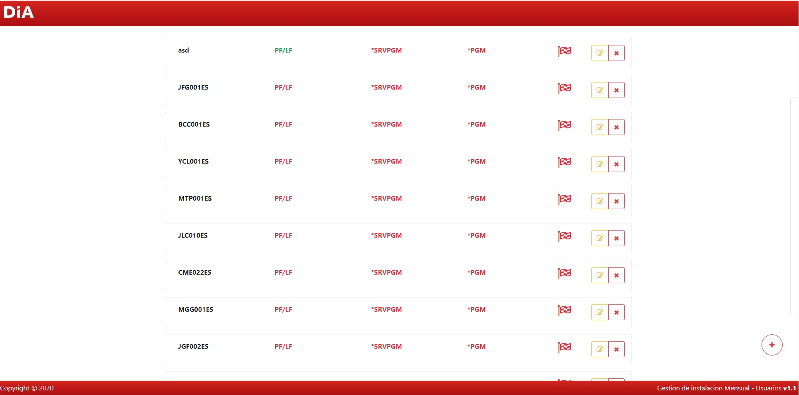

# mtto-angular-firestore
Ejemplo de CRUD realizado con ANGULAR, FIRESTORE y BOOTSTRAP.

> **UPDATE 10/01/2020:**: Repositorio actualizado **(Boton flotante de añadir, Validacion de "usuario" y Longitud de Inputs)
Imagen Principal Artículo <p align="center"></p> 

## Instalación
1. Instalacion de dependencias
```npm install```
```npm install --save firebase @angular/fire -f```
```npm install bootstrap```
```npm install --save font-awesome angular-font-awesome```
```ng add @angular/material```
```npm install @angular/cdk``` 

2. Configurar atributos del **firestore** en el archivo ```environment.ts```

3. Servir la aplicación
```ng serve -o```
